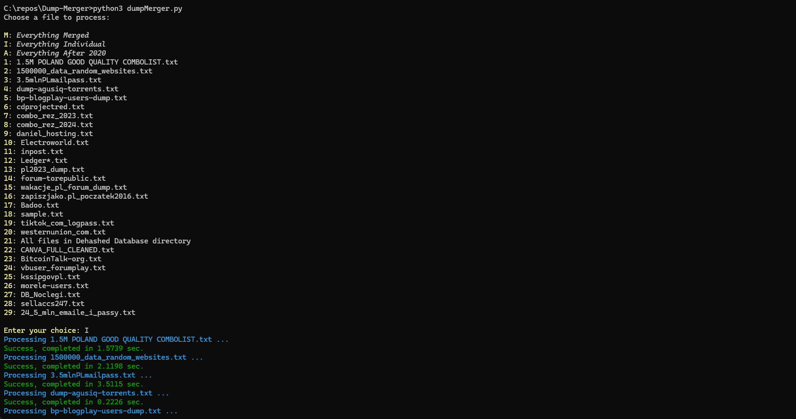

# Dump Merger

The Python script is designed to process various input files, such as database dumps or data from leaks and breaches, and convert them into standardized CSV files. These input files, which might be in various formats, are first parsed and cleaned to ensure consistency and remove any unnecessary or corrupted data. The script then consolidates this data into a uniform structure suitable for CSV export.

The output CSV files are structured in a way that can be easily imported into a database, enabling efficient search capabilities. This allows for the querying of the database to find specific customer data, making it easier to manage and analyze sensitive information from different sources.

## Current Local Scope

Currently the script is able to process the following inputs.

Basic scope:
- **1.5M POLAND GOOD QUALITY COMBOLIST.txt** - 1.5M Combo list of usernames/emails and passwords for Poland from 2021 [https://nulledbb.com/thread-1-5M-Poland-Fresh-UHQ-GOOD-Combolist]
- **1500000_data_random_websites.txt** - Combo list of usernames/emails and passwords from random websites [https://breachforums.st/]
- **24_5_mln_emaile_i_passy.txt** - Combo list of usernames/emails and passwords dated February 2025 [https://biteblob.com/]
- **3.5mlnPLmailpass.txt** - 3.5M Combo list of emails and passwords for Poland [https://breachforums.st/]
- **bp-blogplay-users-dump.txt** - Dump of *blogplay* database dated September 2020 [https://avlab.pl/wyciek-bazy-danych-763-uzytkownikow-z-blogplay-pl/]
- **cdprojectred.txt** - Data breach of CDPR dated February 2021 [https://www.bleepingcomputer.com/news/security/cd-projekt-data-stolen-in-ransomware-attack-now-circulating-online/]
- **combo_rez_2023.txt** - Combo list of usernames/emails and passwords dated 2023 [https://breachforums.st/]
- **combo_rez_2024.txt** - Combo list of usernames/emails and passwords dated 2024 [https://breachforums.st/]
- **daniel_hosting.txt and daniel_hosting_emails.txt** - Data breach of onion database dated March 2020 [https://bitcoin.pl/haker-wykradl-baze-danych-najwiekszego-dostawcy-uslug-hostingowych-w-dark-webie]
- **dump-agusiq-torrents.txt** - Dump from agusiq-torrents.pl dated September 2019 [https://www.ransomlook.io/leak/3699]
- **Electroworld.txt** - Data breach of ElectroWorld [https://breachforums.st/]
- **forum-torepublic/*.txt** - Data breach from ToRepublic forum dated December 2015 [https://zaufanatrzeciastrona.pl/post/pelna-baza-danych-i-uzytkownikow-torepublic-w-rekach-wlamywaczy/?utm_source=chatgpt.com]
- **inpost.txt** - Data breach of InPost dated August 2017 [https://niebezpiecznik.pl/post/inpost-operator-paczkomatow-zhackowany-wyciekla-baza-zawierajaca-dane-na-temat-57-000-pracownikow/]
- **Ledger/*.txt** - Data breach of Ledger dated June 2020 [https://bithub.pl/kryptowaluty/bezpieczenstwo/ledger-wyciek-miliona-adresow-e-mail-potwierdzony/]
- **pl2023_dump.txt** - Combo list of usernames/emails and passwords for Poland dated May 2023 [https://www.chip.pl/2023/05/ogromny-wyciek-danych-w-polskim-internecie-podpowiadamy-jak-sie-ustrzec-przed-skutkami]
- **wakacje_pl_forum_dump.txt** - Data breach of wakacje.pl forum dated November 2021 [https://sekurak.pl/wyciek-z-forum-serwisu-wakacje-pl/]
- **zapiszjako.pl_poczatek2016.txt** - Data breach of zapiszjako.pl from 2016 [https://breachforums.st/]

Batch one:
- **Badoo.txt** - Data breach of Badoo dated year 2013-2016 [https://monitor.mozilla.org/breach-details/Badoo]
- **CANVA_FULL_CLEANED.txt** - Data breach of Canva dated May 2019 containing usernames, emails, and password hashes [https://social.cyware.com/news/gnosticplayers-hacked-canva-website-and-stole-data-of-over-139-million-users-a090636b]
- **DehashedDatabase/*.txt** - Files gathered from Dehashed Database [https://dehashed.com/]
- **sample.txt** - Combo list of usernames/emails and passwords [https://breachforums.st/]
- **tiktok_com_logpass.txt** - Data breach of TikTok dated August 2020 [https://www.twingate.com/blog/tips/TikTok-data-breach]
- **westernunion_com.txt** - Data breach of western union [https://breachforums.st/]

Batch two:
- **BitcoinTalk-org.txt** - Data breach of BitcoinTalk.org dated 2013-2016 [https://cointelegraph.com/news/bitcointalkorg-database-with-500k-accounts-is-being-sold-on-the-dark-web]
- **vbuser_forumplay.txt** - Dump of usernames, IPs, emails, tokens, and secrets from Forum Play [https://breachforums.st/]
- **kssipgovpl.txt** - Leak of usernames, IPs, emails, passwords, and secrets from kksip.gov.pl dated April 2020 [https://gdpr.pl/wyciek-danych-z-krajowej-szkoly-sadownictwa-i-prokuratury]
- **morele-users.txt** - Data breach of morele.net dated November 2018 [https://www.rp.pl/dane-osobowe/art38225061-morele-nie-zaplaci-gigantycznej-kary-za-wyciek-danych-nsa-obciazyl-uodo]
- **DB_Noclegi.txt** - Data breach of Noclegi.pl database [https://breachforums.st/]
- **sellaccs247.txt** - Data breach containing names, emails, and passwords [https://breachforums.st/]
